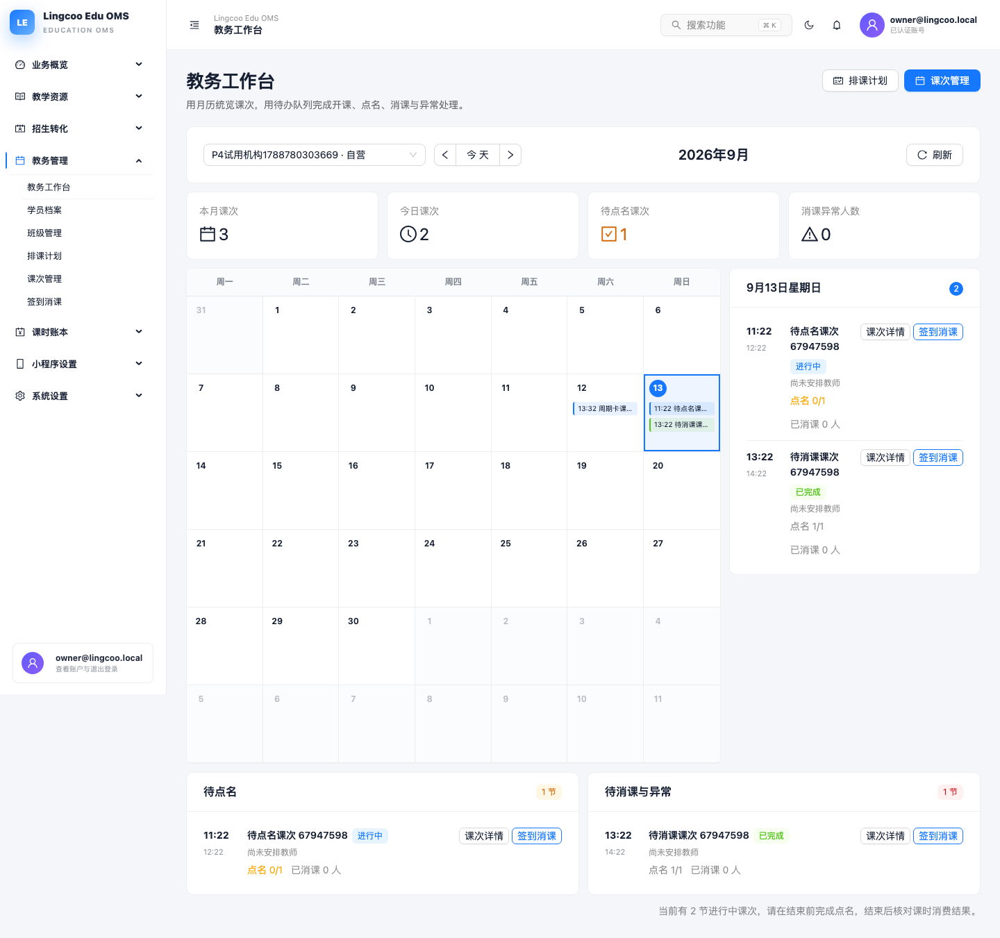

# 后台日历与教务工作台验收报告

验收日期：2026-09-13

## 已实现

- 教务管理菜单新增“教务工作台”，并置于学员、班级、排课、课次和签到消课之前。
- 支持机构切换、上月/今天/下月和刷新。
- 月历按日展示课次时间、名称和状态，支持选择日期查看当日议程。
- 顶部展示本月课次、今日课次、待点名课次和消课异常人数。
- 下方提供“待点名”和“待消课与异常”两类运营队列。
- 每条议程和待办可深链接到指定机构、指定课次的课次详情或签到消课页面。
- 后端工作台聚合增加消课状态摘要，并将月查询安全上限从 100 提升到 500。

## 验证结果

- Contracts 构建通过。
- API Client 测试：18 个测试文件、43 个测试全部通过。
- Server 测试：24 个测试文件、81 个测试通过，17 个集成文件按环境配置跳过。
- Server 与 Admin TypeScript 类型检查通过。
- Admin 生产构建通过。
- Playwright 实际浏览器验收：1 项通过；验证月历、当日议程、待点名、待消课和深链接。
- 页面运行时错误：0。

## 实际效果

本次验收使用真实预览数据库和真实 API 创建课次状态，未使用前端 Mock 数据。

