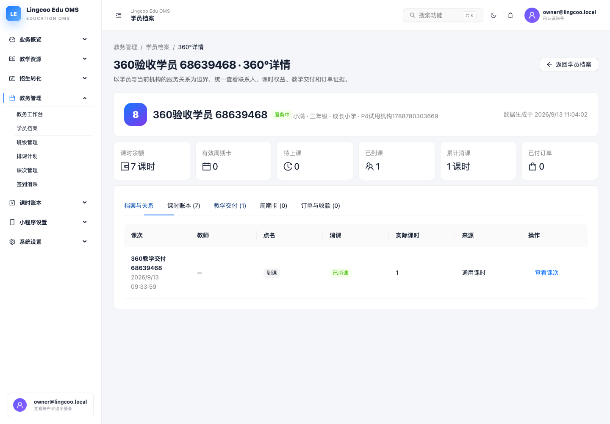
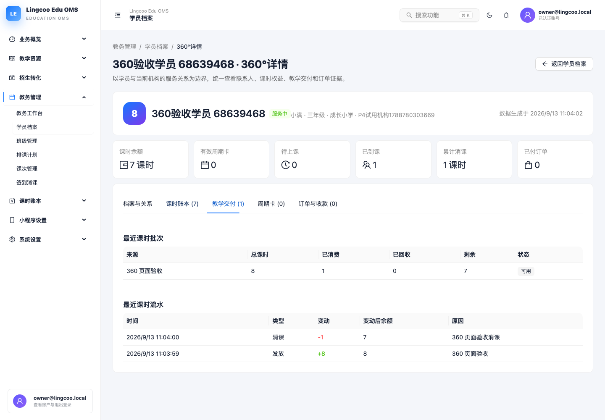

# 学员 360°详情验收报告

验收日期：2026-09-13

## 已实现

- 学员列表新增“360°”入口，支持可刷新深链接。
- 顶部聚合课时余额、有效周期卡、待上课、已到课、累计消课和已付订单。
- 档案与关系：基础档案、家长联系人、当前及历史班级关系。
- 课时账本：最近批次、余额变化、课时流水和业务原因。
- 教学交付：课次、教师、点名、消课、消耗数量和消费来源。
- 周期卡：权益模式、使用量、剩余量、有效期和状态。
- 订单与收款：商品、渠道、支付方式、金额、状态和支付时间。
- 后端新增实时聚合读模块，只依赖各业务模块显式公开 Read Port，无自有表和共享 Repository。

## 实际验收

- 真实数据库创建学员、家长、8 课时批次和一条已到课/已消课交付记录。
- 360°页面显示余额 7、累计消课 1、已到课 1。
- 课时流水同时显示 +8 发放和 -1 消课，变动后余额正确。
- Playwright 浏览器测试 1 项通过，页面运行时错误 0。

## 截图

